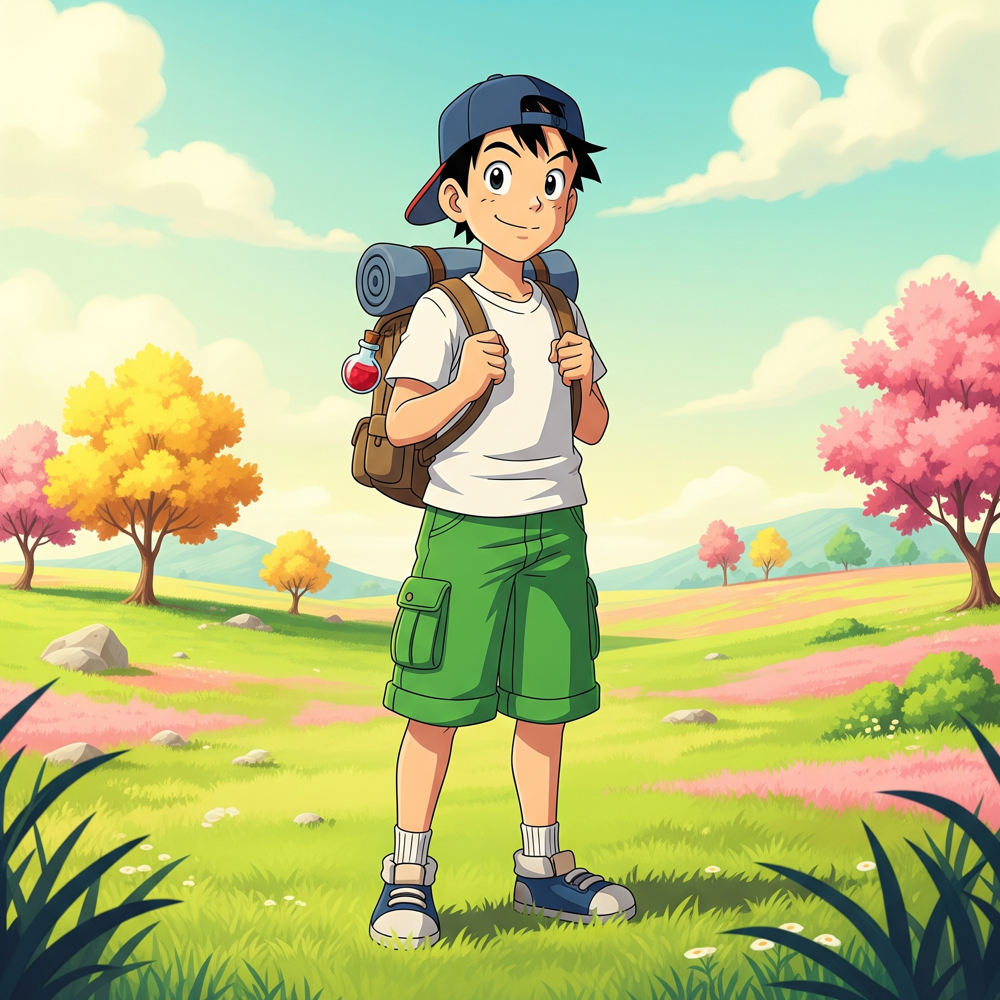
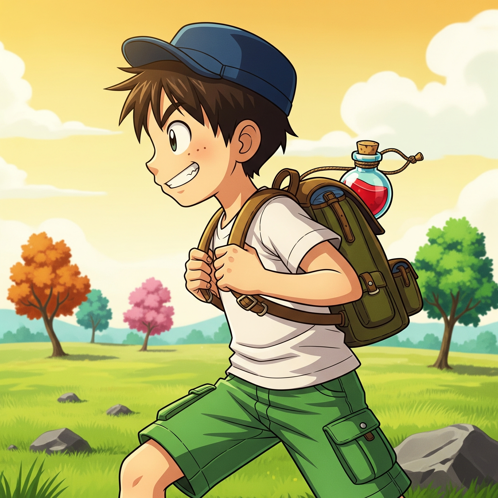
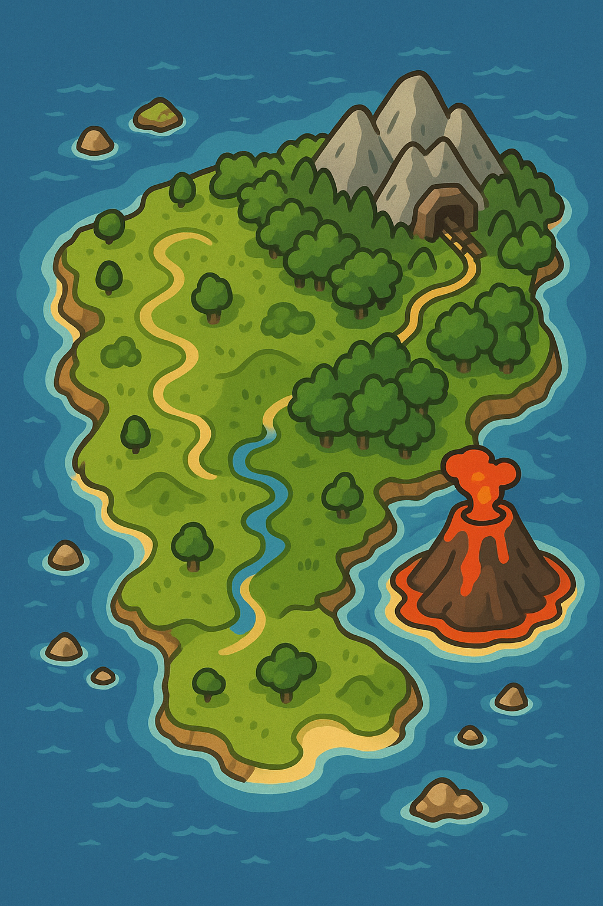
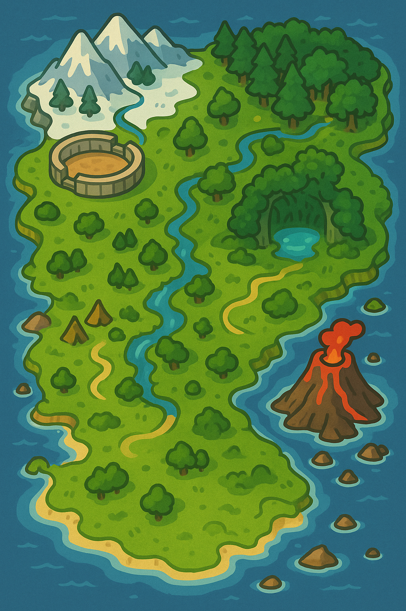
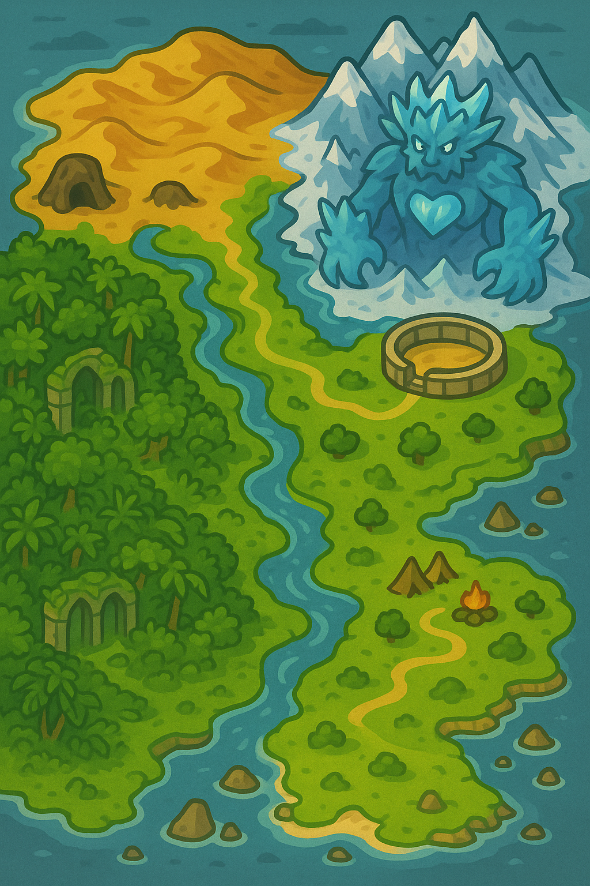
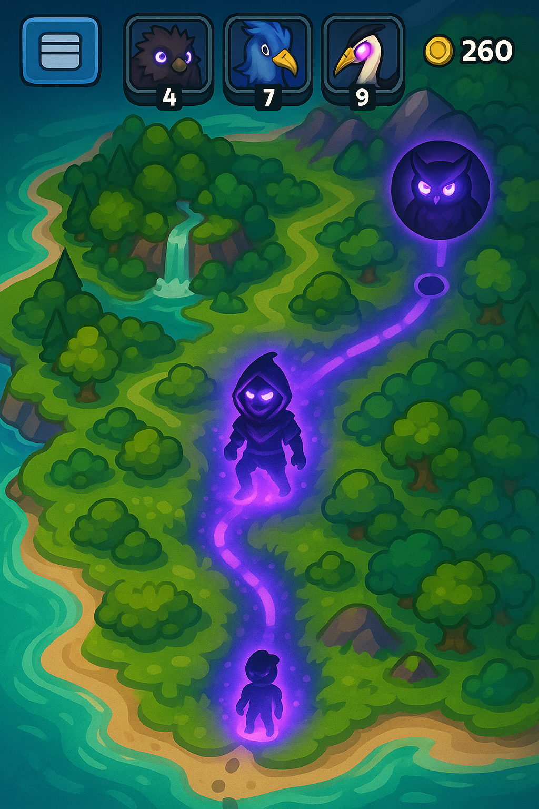
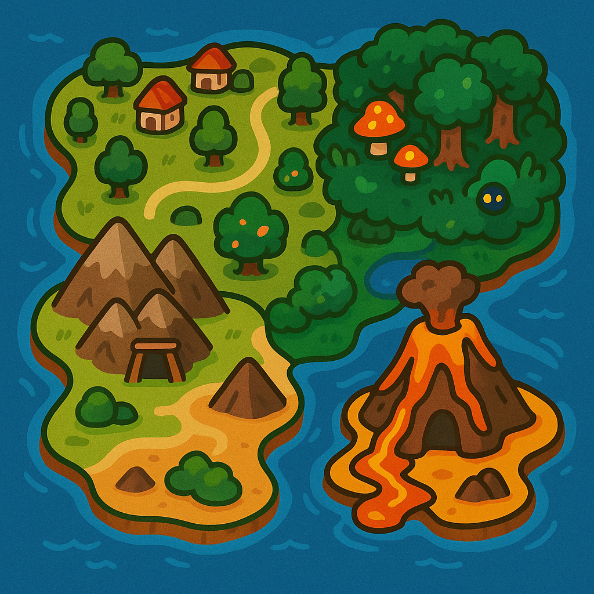

# Overview of the Design Concepts
Here, the design concepts of the game are listed to show an overview of all the companions and other art.

List of designs:
- [Taro, the Trainer](#1-taro-the-trainer)
- [Map](#2-map)

## 1. Taro, the Trainer

  
  

## 2. Map

  
  

  
  

  

